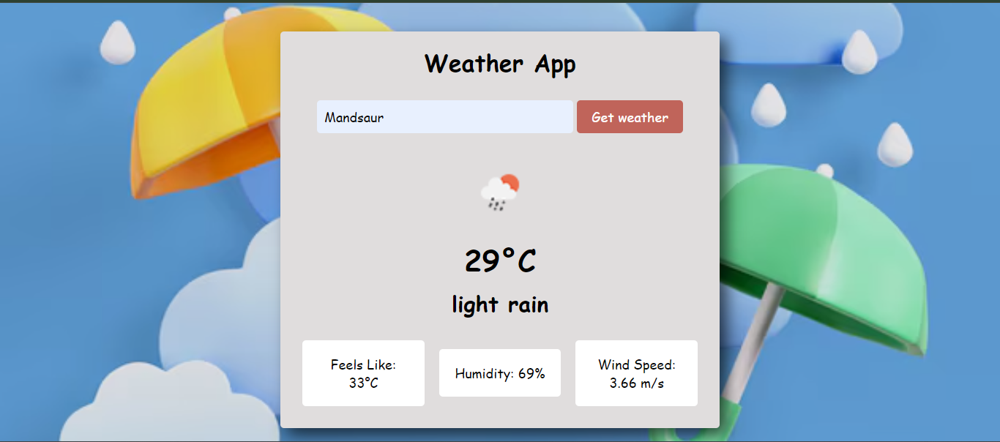
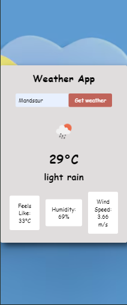

# Weather App 🌦️

A simple weather application that allows users to fetch real-time weather data by entering their city name. This app displays the temperature, weather description, and additional details like feels-like temperature, humidity, and wind speed.

## Features

- 🌍 Get weather details by city name
- 🌡️ Displays temperature, weather condition, and weather icon
- 💨 Displays additional details: "Feels like", "Humidity", and "Wind speed"
- Responsive design

## Preview



## Built With

- **HTML5:** Semantic markup for the structure of the app
- **CSS3:** Styling the app and making it responsive
- **JavaScript (ES6):** Fetching weather data and updating the DOM
- **OpenWeatherMap API:** Fetching real-time weather data

## Installation

1. Clone the repository:

   ```bash
   git clone https://github.com/your-username/weather-app-js.git
   cd weather-app-js
   ```

2. Create a `config.js` file in the root directory and add your OpenWeatherMap API key:

   ```js
   const config = {
     apiKey: 'YOUR_API_KEY_HERE', // Add your API key here
   };
   ```

3. Open `index.html` in your browser.

## Usage

1. Enter your city name in the input field.
2. Click on the "Get weather" button to fetch weather details.
3. The app will display the current temperature, description, and additional weather information.

## API Reference

This project uses the **OpenWeatherMap API** to fetch weather data. You need an API key to use this app, which you can obtain from the [OpenWeatherMap website](https://openweathermap.org/api).

### Example API Request

```bash
https://api.openweathermap.org/data/2.5/weather?q={city name}&appid={API key}&units=metric
```

## Project Structure

```bash
├── index.html        # Main HTML file
├── style.css         # Styling for the Weather App
├── script.js         # JavaScript file for fetching weather data and DOM manipulation
├── config.js         # API Key configuration file
└── bg-1.avif         # Background image for the app
```

## Screenshots

### Desktop View


### Mobile View



## Future Enhancements

- Add support for multiple cities.
- Display forecast for the next 5 days.
- Show error messages for invalid city names.

## License

This project is open-source and available under the [MIT License](./LICENSE).

---

Feel free to contribute to the project by submitting a pull request or creating an issue.